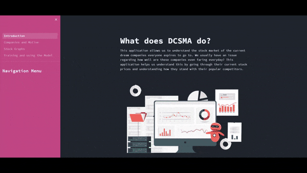

# DCSMA
DCSMA (Dream Companies Stock Market Analysis) is a one stop application to understanding more about the stock market of your dream companies



The application uses linear regressor machine learning model and the yfinance API in order to get up to date stock prices. It helps us to determine how the organization is doing at the moment and is written in Python and Streamlit supporting the front and backend for the web application
- - - -
### Run the App
The app is hosted on streamlit cloud and you can access it via this link given: 
[Run DCSMA](https://aabhijitha-dcsma-introduction-lxtdd2.streamlit.app/)
- - - -
### Functionalities
* Choice of the analysis of the 6 most sought out software companies.
* It uses the yfinance API to get real time information of the stocks.
* Easy to understand graphs for the stocks.
* Via machine learning and model coefficients it helps us to decide how to invest in them or what is the state of the organization.
- - - -
### Setup
Clone the repository by download or via the link below:
```
https://github.com/AAbhijithA/DCSMA.git
```
We can use anaconda for this so download anaconda and run a virtual environment and open the terminal in the anaconda navigator
Do the following installations in the anaconda terminal opened (These are the frameworks/libraries used)
```
> pip install streamlit
> pip install streamlit_lottie
> pip install numpy
> pip install pandas
> pip install matplotlib
> pip install yfinance
> pip install scikit-learn
```
After the following installations you are good to go
- - - -
### Running the Application
To run the application use the following command after going to the directory
```
> streamlit run Introduction.py
```
That should cover most of the pre-requisites for running the project in your personal device (enjoy :D)


